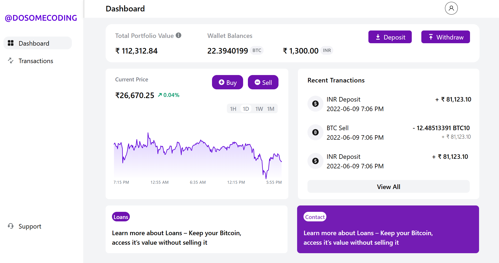
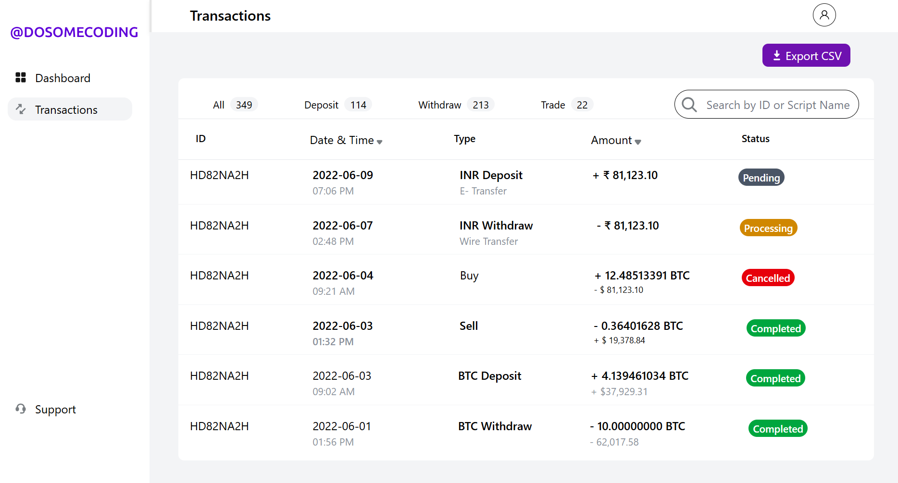
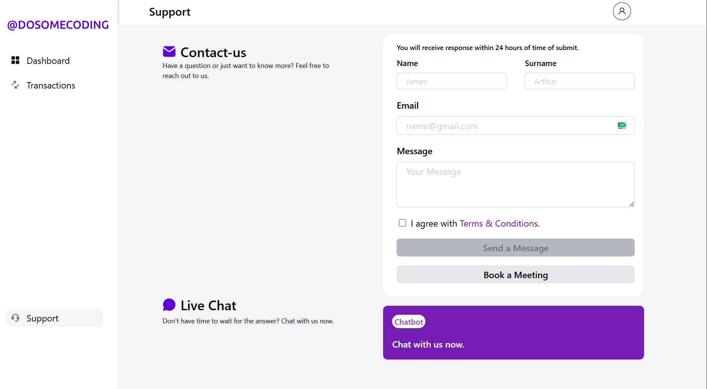

**Crypto Dashboard**

This is a simple Crypto Dashboard application built using React and Tailwind CSS. The app is designed to provide users with a basic interface for viewing cryptocurrency data, transactions, and support options. As of now, the application uses hardcoded data, which will be replaced with dynamic data sources in future versions.

**Project Overview**

This project is an initiative to learn and practice building user interfaces and reusable components using React and Tailwind CSS. While the current version of the app is based on hardcoded data, the goal is to understand how to create scalable and attractive UIs and set up routing with React.

The app contains three pages:

Dashboard: Displays cryptocurrency data (currently static) and various statistics.

Transactions: A page to view cryptocurrency transaction history (static data for now).

Support: A contact form and live chat option for user inquiries.

React Router is used to navigate between these pages, with routes set up using NavLink components.

**Technologies Used**

React: The JavaScript library for building user interfaces.

Tailwind CSS: A utility-first CSS framework for styling components.

React Router DOM: For setting up routing and navigation between different pages.

React Hooks: Used for managing state in functional components.

##Features##

Responsive Design: The app is fully responsive, thanks to the utility classes provided by Tailwind CSS.

Navigation: Routes are set up using NavLink components from React Router, providing navigation between the pages.

Reusable Components: The app uses reusable React components to keep the code DRY (Don't Repeat Yourself).

Hardcoded Data: Displays mock cryptocurrency data to simulate a real-time crypto dashboard.

**Project Setup**

To run this project locally on your machine, follow the steps below:

1. Clone the Repository
   git clone https://github.com/Jithu666/crypto-dashboard.git

2. Navigate to the Project Folder
   cd crypto-dashboard

3. Install Dependencies
   npm install

4. Run the Application
   Once the dependencies are installed, start the development server: npm start

**_Pages_**

1. Dashboard
   The Dashboard page displays mock data of cryptocurrencies with their prices, market cap, and other key metrics. It's built to give a high-level overview of the market.

2. Transactions
   The Transactions page will allow users to see their recent cryptocurrency transactions (currently static).

3. Support
   The Support page contains a contact form where users can reach out for help or support, as well as a live chat button (hardcoded for now).

##Screenshots: ##

Home Page/Dashboard:

Transactions Page:

Support Page:

